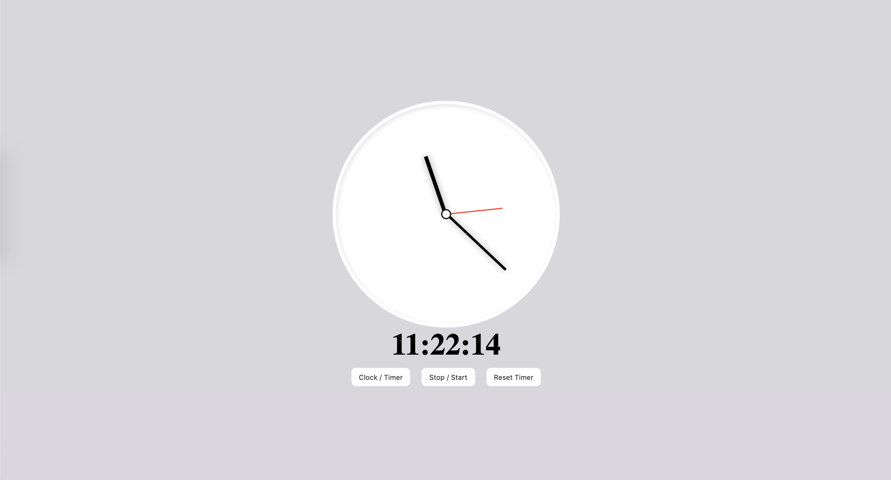

# CSS Clock

To start the exercise, start a simple http server on local from the clockSkeleton folder.

This exercise is designed to test candidates on their ability to:
- **Cooperate** in a team-like environment
- Understand simple **feature stories**
- **Reason** in order to accomplish small successive tasks
- **Adapt** to an already existing small code base (in html and javascript)
- **Look for informations** efficiently

# Context
You joined a team overly hyped by a bad clock website. Everything about the product sucks, but the Product team rocks! They provided the Dev team with specific user stories to ease the development process. 

# Clock and Timer EPIC

As a user, I want to access the app the see the time. And be able to switch from "clock" mode to "timer" mode easily. I also need to be able to stop the clock in both mode, and to reset the timer.

### Create an analog clock with the watch dial, based on the user's timezone

As a user, I want to see a clock based on my timezone on the main page of the app. The watch dial should be updated every second and synchronised with the digital clock. The "minute" and "hour" hands must move fluidly.

### Create a 24h digital clock, based on the user's timezone

As a user, I want to see a 24h digital clock based on my timezone on the main page of the app. The digit watch dial should be updated every second and synchronised with the analog clock. The  "hour", "minute" and "second" sections must be composed of two digits integers.

ex: 12:02:54 and not 12.4:2:54

### Create a "timer" mode for the digital and analog clocks

As a user I want to be able to access a timer. The timer mode should always start at 0 and be updated 10 times per second, with a fluid movement for the "second" hand. Both the analog and the digital clock should switch modes and be updated synchronously.

### Create a "switch" button to navigate between "clock" and "timer" mode

As a user I want to switch back and forth between a "clock" mode and a "timer" mode by clicking on "Clock / Timer". The timer mode can be initialised and stay at 0 seconds.

### Create a "stop" button for both modes

As a user I want to be able to stop the clock and the timer mode by clicking on a "stop" button. Clicking back on it should start the timer back were it stopped and set the clock to the current time.

### Create a "reset" button for "timer" mode

As a user I want to be able to reset the timer on "timer" mode by clicking on a "reset" button. Clicking on it resets the timer to 0.
